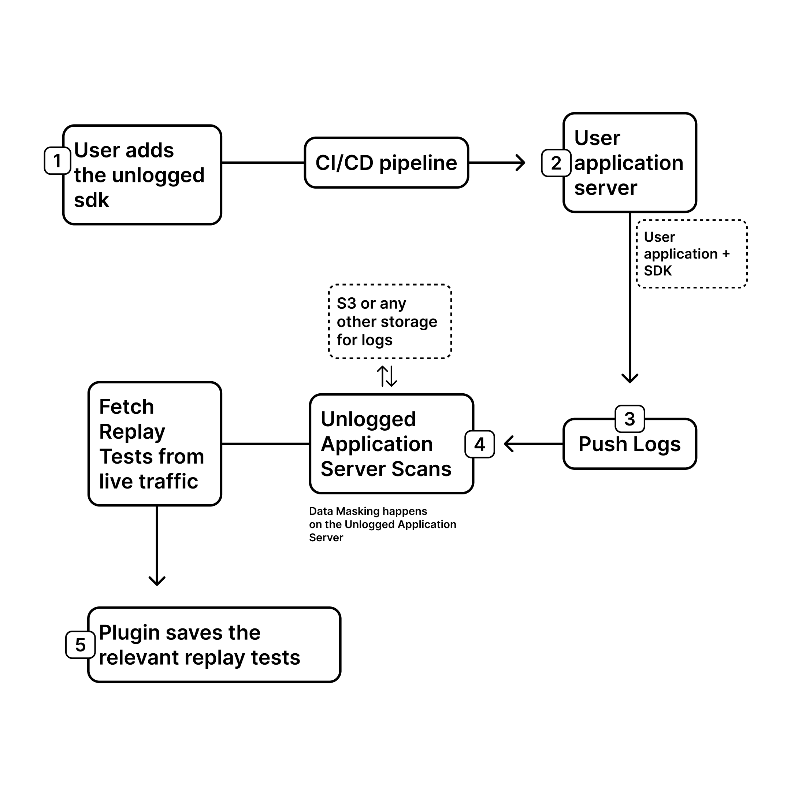

<p align="center">
  <a href="https://www.unlogged.io/">
    
  </a>
</p>

<p align="center">
  Record. Replay. Test. 
</p>

<p align="center"><sup>
  <a href="https://unloggedio.github.io/documentation/"><strong>Documentation</strong></a> ·
  <a href="https://www.unlogged.io/bug-bounty-program"><strong>Bug Bounty</strong></a> ·
  <a href="https://mvnrepository.com/artifact/video.bug/unlogged-sdk/"><strong>Maven</strong></a> ·
  <a href="https://plugins.jetbrains.com/plugin/18529-unlogged"><strong>IntelliJ Plugin</strong></a>
  </sup>
</p>
<p align="center">
  <a href="https://mvnrepository.com/artifact/video.bug/unlogged-sdk"></a>
  <a href="https://plugins.jetbrains.com/plugin/18529-unlogged"></a>
</p>
<br/>


# Unlogged Server
The unlogged server is a self-hosted service, that can be used with plugin and SDK. Deploy the production service with SDK and it will push the logs to unlogged server. Then the intellij IDEA can download the test candidates, and the production traffic can be replayed locally.

<p align="center">
  
</p>

## Deployment without a S3 bucket

### Deployment with a local minio server

- The server can be deployed with a minio instance. This is a sample docker-compose file for the same:
```docker
version: '2'

services:
  unlogged_server:
	image: public.ecr.aws/z6h2b9v3/unlogged_server:latest
	ports:
	  - "8123:8123"
	environment:
	  - cloud.bucketName=session-logs
	  - cloud.endpoint=http://minio:9000
	  - cloud.aws.region.static=ap-south-1
	  - cloud.aws.credentials.access-key=minio_user
	  - cloud.aws.credentials.secret-key=minio_password
	networks:
	  - unlogged_network
	volumes:
	  - unlogged_volume:/usr/src/app/local-session

  minio:
	image: minio/minio
	container_name: minio
	ports:
	  - "9000:9000"
	command: server /data
	environment:
	  - MINIO_ROOT_USER=minio_user
	  - MINIO_ROOT_PASSWORD=minio_password
	networks:
	  - unlogged_network
	volumes:
	  - unlogged_volume:/usr/src/app/local-session

networks:
  unlogged_network:
    driver: bridge

volumes:
  unlogged_volume:
    external: true
```

## Deployment with a S3 bucket
A S3 bucket needs to created for storing the logs.

### Creating a S3 bucket.

- Create a private S3 bucket in AWS.
- To use the server following environment variables are needed:
	1. `bucket_name`: Name of the s3 bucket
	2. `bucket_region_url`: This is the URL of s3 region. For example `https://s3.eu-west-1.amazonaws.com`
	3. `bucket_region`: This is region of S3 bucket. For example: eu-west-1.
	4. To get the `access_key` and `secret_key` go to the security credentials of you account and create an access key.

### Deploying the server

The server can be deployed using docker or the jar file. It can be done on both a private pc for personal testing and an instance of EC2 with public IP for company wide deployment.

#### Deployment from JAR
- The jar can be downloaded from [here](https://github.com/unloggedio/server/releases).
- To deploy the service using jar use the following command:

```sh
java -jar -Dcloud.bucketName=bucket_name \
    -Dcloud.endpoint=bucket_region_url \
    -Dcloud.aws.region.static=bucket_region \
    -Dcloud.aws.credentials.access-key=access_key \
    -Dcloud.aws.credentials.secret-key=secret_key \
    unlogged_server.jar
```

#### Docker Deployment 
- To deploy the server from docker run the following commands:

```sh
# create a docker volume 
docker volume create unlogged_volume

# run the docker container
docker run -dp 8123:8123 
-v unlogged_volume:/usr/src/app/local-session 
-e cloud.bucketName=bucket_name
-e cloud.endpoint=bucket_region_url
-e cloud.aws.region.static=bucket_region
-e cloud.aws.credentials.access-key=access_key
-e cloud.aws.credentials.secret-key=secret_key
public.ecr.aws/z6h2b9v3/unlogged_server:latest
```

#### Docker-compose Deployment
- The server can be deployed using docker compose. An example docker-compose file is as follows:

```sh
version: '2'

services:
  unlogged_server:
    image: public.ecr.aws/z6h2b9v3/unlogged_server:latest
    ports:
      - "8123:8123"
    volumes:
      - unlogged_volume:/usr/src/app/local-session
    environment:
      - cloud.bucketName=bucket_name
      - cloud.endpoint=bucket_region_url
      - cloud.aws.region.static=bucket_region
      - cloud.aws.credentials.access-key=access_key
      - cloud.aws.credentials.secret-key=secret_key

volumes:
  unlogged_volume:
    external: true
```

- Create a volume using `docker volume create unlogged_volume`
- Run the container using `docker compose -f path_to_file up -d`


## Verifying the status of deployed service

- If deployed on local machine go to `http://localhost:8123/session/ping`
- If deployed on an EC2 instance go to `http://public_ip:8123/session/ping`


## Docker Registries
The unlogged docker image is available on the following registries:

- Amazon ECR: [`public.ecr.aws/z6h2b9v3/unlogged_server`](https://us-east-1.console.aws.amazon.com/ecr/public-registry/repositories?region=us-east-1)
- Github GHCR: [`ghcr.io/unloggedio/unlogged_server:latest`](https://github.com/orgs/unloggedio/packages/container/package/unlogged_server)


## Hardware Requirements
1. The smallest server on AWS that will work with unlogged server is something like `t2.micro`. 
It's system requirements are:
- Number of vCPU: 1
- Memory: 1 GiB
- Disk Space: 30 GiB (type gp3)
- Network Performance: Low to Moderate

2. A recommended system that would work with a higher throughput of logs will be a little larger like `t2.xlarge`.
It's system requirements are:
- Number of vCPU: 4
- Memory: 16 GiB
- Disk Space: 120 GiB (type gp3)
- Network Performance: Moderate
